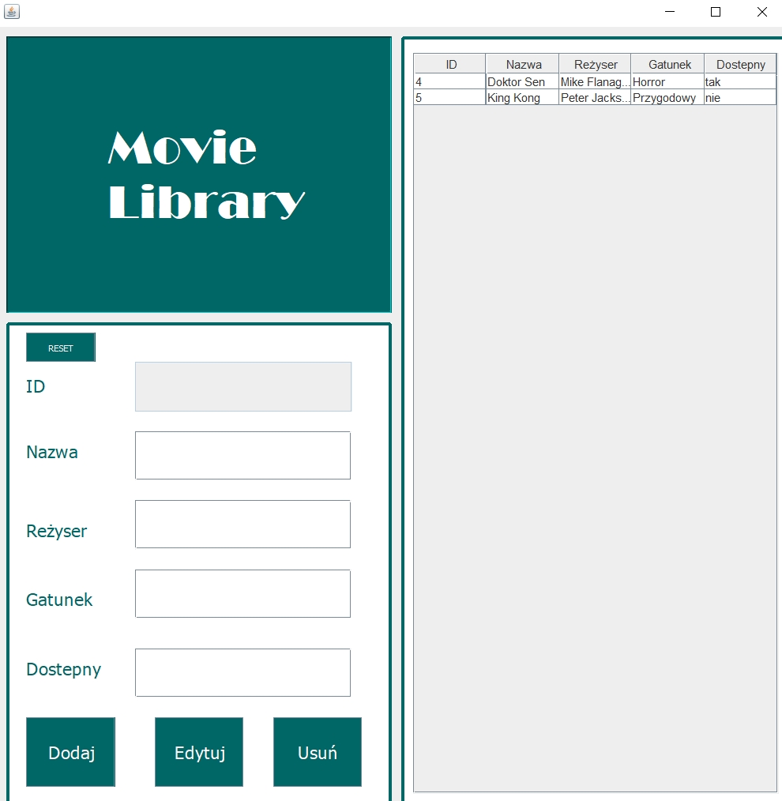

# MovieLibrary

# Netbeans Project
<p> </p>
<div>
  
  </div>
  <p> </p>
<h1>Overlook:</h1>
<p> </p>
<h2>Logowanie:</h2>
<p> </p>
<div>
  
  </div>
  <p> </p>
  <h2>Biblioteka:</h2>
  <p> </p>
<div>
  
  </div>
 <p> </p>
<h1>Procedury w SQL:</h1>
<div>
  <h1> Dodawanie Filmu </h1>
  
  <p> </p>
  
```js
USE [MovieLibrary]
GO
SET ANSI_NULLS ON
GO
SET QUOTED_IDENTIFIER ON
GO
ALTER procedure [dbo].[dodajFilm]
@nazwa varchar(50) ,
@rezyser varchar(50),
@gatunek varchar(50),
@dostepny varchar(10)
AS
SET NOCOUNT ON
BEGIN
insert into moviess values 
(@nazwa,@rezyser,@gatunek,@dostepny) 
end
```  

  <p> </p>
  
<h1>Edycja Filmu</h1> 

  <p> </p>
  
```js
USE [MovieLibrary]
GO
SET ANSI_NULLS ON
GO
SET QUOTED_IDENTIFIER ON
GO
ALTER procedure [dbo].[edytujFilm]
@id int,
@nazwa varchar(50),
@rezyser varchar(50),
@gatunek varchar(50),
@dostepny varchar(50)
as 
begin 
update moviess 
set nazwa=@nazwa, rezyser=@rezyser, gatunek=@gatunek, dostepny=@dostepny
where @id = ID;
end
```

  <p> </p>
  
<h1>Procedura Logowania</h1>

  <p> </p>
  
```js
USE [MovieLibrary]
GO
SET ANSI_NULLS ON
GO
SET QUOTED_IDENTIFIER ON
GO
ALTER procedure [dbo].[logujMnie]
@nazwa varchar(50),
@haslo varchar(50)
as
begin
select * from logowanie where @nazwa = nazwa and @haslo=haslo
end
```

  <p> </p>
  
<h1>Procedura Pobierania Danych</h1>

  <p> </p>
  
```js
USE [MovieLibrary]
GO
SET ANSI_NULLS ON
GO
SET QUOTED_IDENTIFIER ON
GO
ALTER procedure [dbo].[pobierzDane]
as
begin
select * from moviess
end
```

  <p> </p>
  
<h1>Usuwanie Filmu</h1>

  <p> </p>
  
```js
USE [MovieLibrary]
GO
SET ANSI_NULLS ON
GO
SET QUOTED_IDENTIFIER ON
GO
ALTER procedure [dbo].[usunFilm]
@id int
AS
SET NOCOUNT ON
BEGIN
delete from moviess where
(@id=ID) 
end
```

  <p> </p>
    </div>
